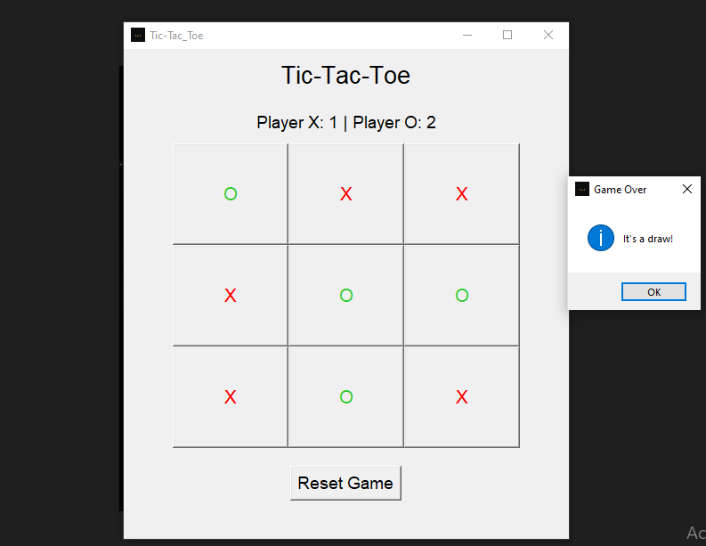

# Tic-Tac-Toe Application

## Overview

This is a graphical Tic-Tac-Toe game developed in Python using the Tkinter library. The game allows players to compete against each other in a 3x3 grid or play against an AI opponent. It features a main menu to choose between two-player mode or single-player mode (AI), along with a scoring system to keep track of wins for both players.

## Features

- **Two Game Modes**: 
  - **Two Players**: Human vs. Human.
  - **Single Player**: Human vs. AI.
- **Dynamic Board Grid**: The game consists of a 3x3 grid that resets after each round.
- **Score Tracking**: Tracks scores for Player X and Player O across multiple rounds.
- **AI Mode**: In single-player mode, Player O is controlled by an AI which makes random moves.
- **Reset Option**: Reset the game without restarting the program.
- **Custom Icons and Colors**: 
  - Player X's moves are displayed in **red**.
  - Player O's moves are displayed in **lime green**.
  - The game uses a custom crown icon.

## How to Run

### Prerequisites

- Python 3.x installed on your machine.
- Tkinter library (usually comes with standard Python installations).

### Instructions

1. Clone or download the source code to your local machine.
2. Ensure you have the file `crown_icon.ico` in the same directory as the script for the window icon.
3. Run the `tic_tac_toe.py` file in your Python environment.

   ```bash
   python tic_tac_toe.py
   ```

4. Upon running the program, a menu will appear:
   - Select between **Two Players** or **Play against AI**.
   - Click **Start Game** to begin.

5. **Gameplay**:
   - In the game window, click on an empty button in the grid to make your move.
   - The current player alternates between **X** (red) and **O** (lime green).
   - The game checks for a winner after every move. If a player wins or the game ends in a draw, a message will appear.
   - The scores are updated after each round.
   - Use the **Reset Game** button to start a new game without closing the application.

### Files Included

- `tic_tac_toe.py`: Main Python script containing the game logic and UI.
- `crown_icon.ico`: Custom icon for the game window.
